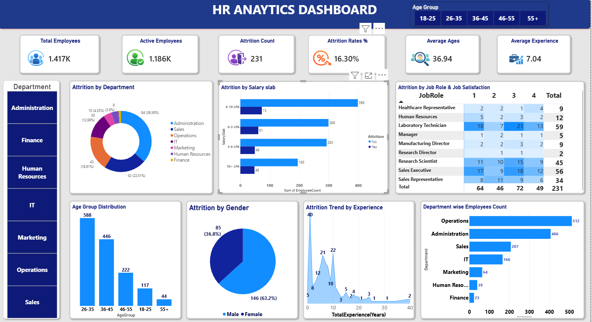

# HR Analytics Dashboard

Interactive Power BI dashboard analyzing employee attrition, workforce demographics, retention trends, and key HR metrics to support data-driven HR decision-making.

## Project Overview

This HR Analytics Dashboard was developed to analyze workforce data and provide insights into employee attrition, retention, demographics, and overall workforce trends. The dashboard enables HR teams and management to monitor key workforce metrics, identify factors contributing to employee turnover, and support data-driven decision-making.

## Tools Used

* Power BI
* Microsoft Excel
* Power Query
* DAX

## Key Metrics

* Total Employees
* Active Employees
* Attrition Count
* Attrition Rate
* Average Age
* Average Experience

## Dashboard Features

* Employee Attrition Analysis
* Department-wise Workforce Distribution
* Gender-wise Employee Analysis
* Age Group Analysis
* Education Field Analysis
* Experience and Tenure Insights
* Interactive Filters and Slicers

## Business Insights

* Identified departments with the highest employee attrition.
* Analyzed workforce demographics and employee distribution.
* Evaluated the relationship between employee experience and attrition.
* Highlighted key factors influencing employee turnover.
* Provided insights to support employee retention and workforce planning strategies.

## Project Outcome

The dashboard provides a comprehensive view of workforce performance and employee attrition trends, helping organizations make informed HR decisions and improve retention strategies through data-driven insights.

## Files Included

* HR Analytics Dashboard.pbix
* HR Dataset.xlsx
* Dashboard Screenshot.png

